 

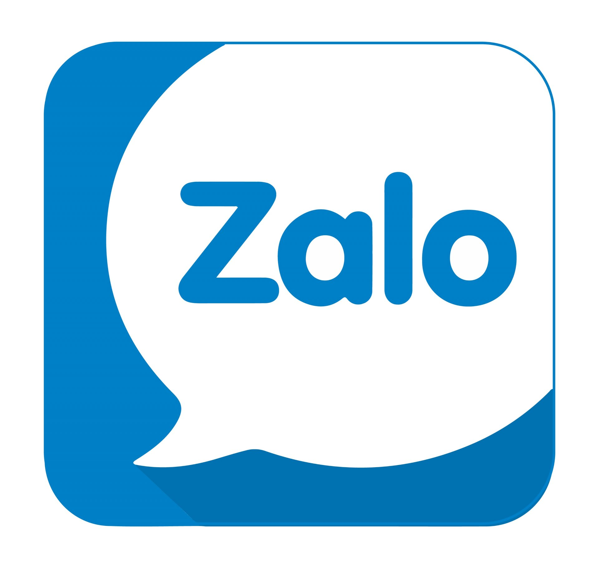

# Zalo-App-Clone

Zalo mobile app are created by Group 6 of HUST-K63 in React Native.
 Find its Github repo  <a href='https://github.com/phungminhhieu1206/Zalo-App-Clone'>here</a>

## Features

* Authentication using JWT.
* Forgot password.
* Edit your profile.
* Follow / Unfollow users.
* create / edit / delete posts.
* create / delete comments.
* Like / Unlike posts.
* Personal chat with users.
* Notifications on new messages.

## Demo

<h4 align="center">Login Screen &nbsp&nbsp&nbsp&nbsp | &nbsp&nbsp&nbsp&nbsp Signup Screen &nbsp&nbsp&nbsp&nbsp | &nbsp&nbsp&nbsp&nbsp My Channel Screen</h4>
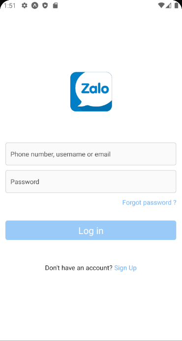
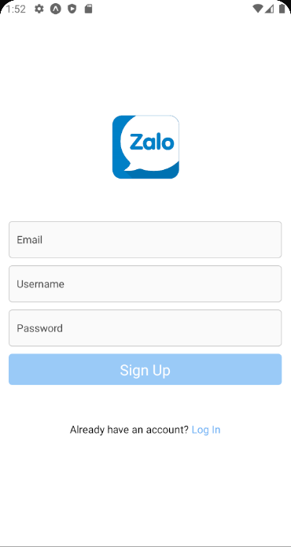
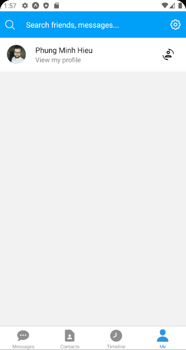

<h4 align="center">Posts Screen &nbsp&nbsp&nbsp&nbsp | &nbsp&nbsp&nbsp&nbsp Post Detail Screen &nbsp&nbsp&nbsp&nbsp | &nbsp&nbsp&nbsp&nbsp Add New Post Screen</h4>
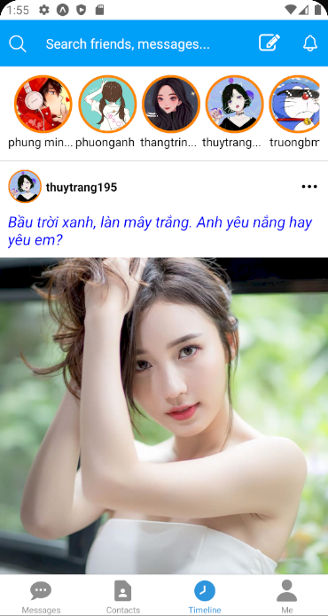
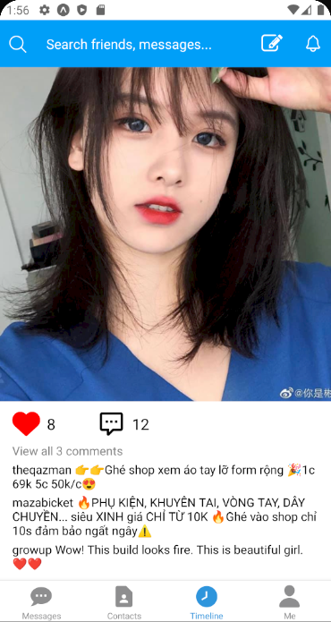
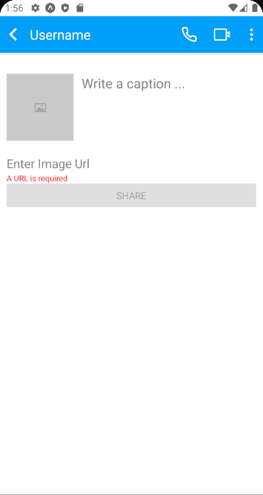

<h4 align="center">Chat Screen &nbsp&nbsp&nbsp&nbsp | &nbsp&nbsp&nbsp&nbsp Chat Room &nbsp&nbsp&nbsp&nbsp | &nbsp&nbsp&nbsp&nbsp Search Friend Screen</h4>
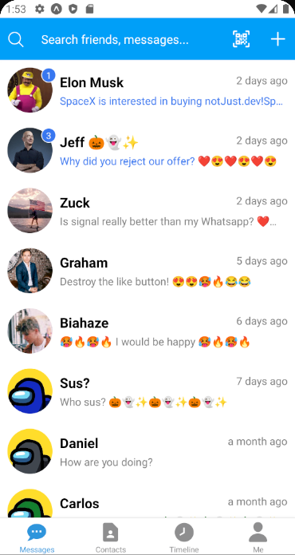
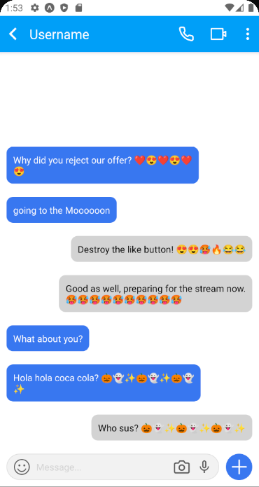
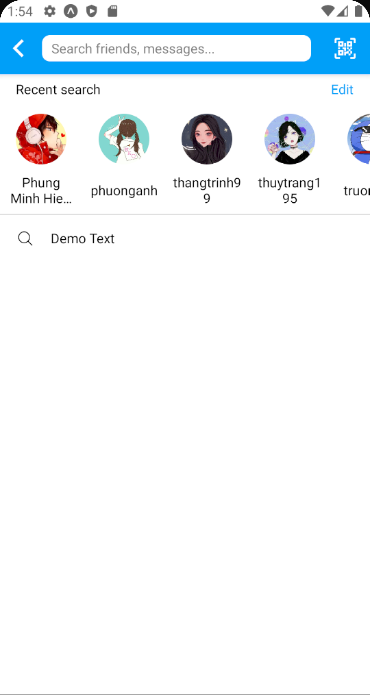

<h4 align="center">Settings App Screen &nbsp&nbsp&nbsp&nbsp | &nbsp&nbsp&nbsp&nbsp Setup My Channel</h4>
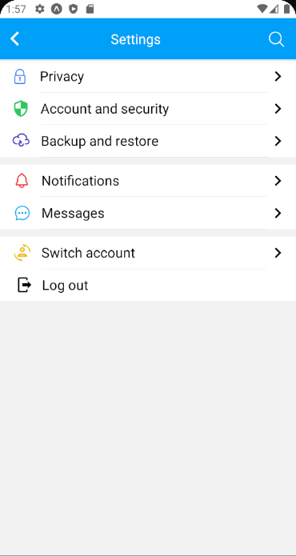
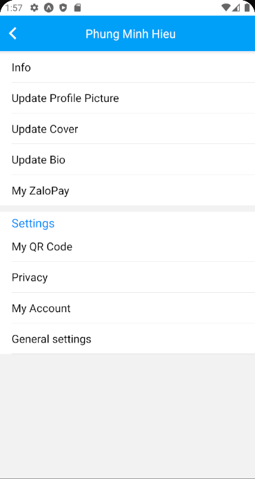

## Run project locally

* clone this Repository by `git clone https://github.com/phungminhhieu1206/Zalo-App-Clone.git`.
* Change directory `cd Zalo-App-Clone`
* Make sure you have expo-cli installed. If not run `npm install -g expo-cli`
* Install the dependencies using `npm install`
* Run `npm start`
* Then type in terminal `a` to run on android emulator, `i` to run on ios simulator.

For more info read `https://reactnative.dev/docs/getting-started`